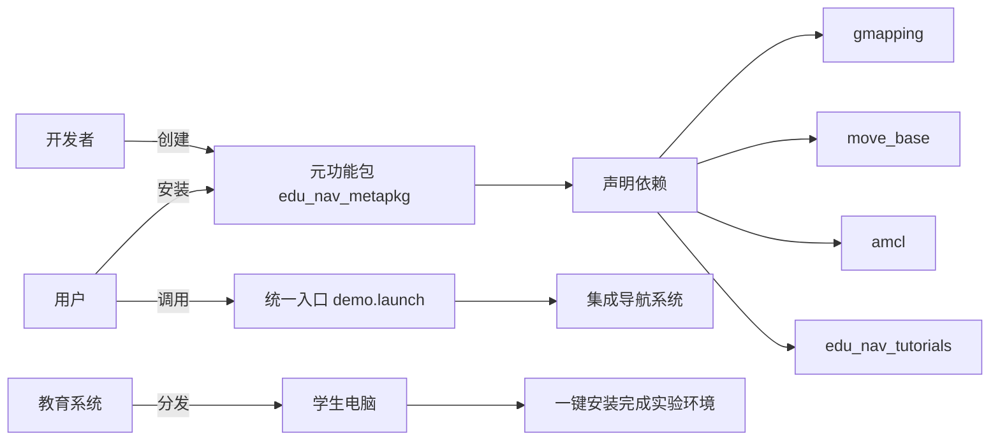

# 第 4 章 ROS运行管理

ROS是多进程(节点)的分布式框架，一个完整的ROS系统实现：

> 可能包含多台主机；
> 每台主机上又有多个工作空间(workspace)；
> 每个的工作空间中又包含多个功能包(package)；
> 每个功能包又包含多个节点(Node)，不同的节点都有自己的节点名称；
> 每个节点可能还会设置一个或多个话题(topic)...


在多级层深的ROS系统中，其实现与维护可能会出现一些问题，比如，如何关联不同的功能包，繁多的ROS节点应该如何启动？功能包、节点、话题、参数重名时应该如何处理？不同主机上的节点如何通信？

本章主要内容介绍在ROS中上述问题的解决策略(见本章目录)，预期达成学习目标也与上述问题对应：

- 掌握元功能包使用语法；
- 掌握launch文件的使用语法；
- 理解什么是ROS工作空间覆盖，以及存在什么安全隐患；
- 掌握节点名称重名时的处理方式；
- 掌握话题名称重名时的处理方式；
- 掌握参数名称重名时的处理方式；
- 能够实现ROS分布式通信。

## 4.1 ROS元功能包

> **场景:**完成ROS中一个系统性的功能，可能涉及到多个功能包，比如实现了机器人导航模块，该模块下有地图、定位、路径规划...等不同的子级功能包。那么调用者安装该模块时，需要逐一的安装每一个功能包吗？

显而易见的，逐一安装功能包的效率低下，在ROS中，提供了一种方式可以将不同的功能包打包成一个功能包，当安装某个功能模块时，直接调用打包后的功能包即可，该包又称之为元功能包(metapackage)。

**概念**

MetaPackage是Linux的一个文件管理系统的概念。是ROS中的一个虚包，里面没有实质性的内容，但是它依赖了其他的软件包，通过这种方法可以把其他包组合起来，我们可以认为它是一本书的目录索引，告诉我们这个包集合中有哪些子包，并且该去哪里下载。

例如：

- sudo apt install ros-noetic-desktop-full 命令安装ros时就使用了元功能包，该元功能包依赖于ROS中的其他一些功能包，安装该包时会一并安装依赖。

还有一些常见的MetaPackage：navigation moveit! turtlebot3 ....

**定义**

1. **虚拟包结构**
	元功能包通常只包含两个文件：
	- **`package.xml`**：声明依赖的其他功能包（通过`<exec_depend>`标签列出所有子包）和`<export><metapackage/></export>`标识2610。
	- **`CMakeLists.txt`**：仅需调用`catkin_metapackage()`（ROS1）或`ament_package()`（ROS2），无其他编译逻辑678。
2. **无实质内容**
	与普通功能包不同，元功能包**没有`src`、`scripts`、`launch`等目录**，仅作为“目录索引”存在2610。

**作用**

1. **简化安装与管理**
	用户只需安装一个元功能包，系统会自动安装其依赖的所有子包。例如：

	bash

	```
	sudo apt install ros-noetic-navigation  # 一次性安装导航相关的所有包（如AMCL、move_base等）
	```

	替代逐一安装子包，大幅提升效率4610。

2. **逻辑整合功能模块**
	将分散的功能包按应用场景聚合，例如：

	- **机器人导航**：整合地图服务（`map_server`）、路径规划（`move_base`）、定位（`amcl`）等包610。
	- **SLAM或机械臂控制**：如`navigation`、`moveit`等知名元功能包68。

3. **兼容性与生态统一**

	- 取代ROS早期的“Stack”概念，提供更规范的包管理方式6。
	- 支持跨版本和跨平台依赖管理，确保子包版本兼容性78。

**实现**

**首先:**新建一个功能包

**然后:**修改**package.xml** ,内容如下:

```xml
<exec_depend>sub_package1</exec_depend>
<exec_depend>sub_package2</exec_depend>
<export>
    <metapackage />  <!-- 声明为元功能包 -->
</export>
```

**最后:**修改 CMakeLists.txt,内容如下:

```cmake
cmake_minimum_required(VERSION 3.0.2)
project(demo)
find_package(catkin REQUIRED)
catkin_metapackage()
```

PS:CMakeLists.txt 中不可以有换行。

**典型应用场景**

1. **大型系统集成**
	- 如自主导航套件`neonavigation`，集成路径规划（`planner_cspace`）、避障（`safety_limiter`）等子包，实现完整导航流程4。
2. **教学与快速原型**
	- 教程包（如`ros-academy-for-beginners`）通过元功能包一键安装所有示例依赖6。
3. **ROS基础安装**
	- `ros-noetic-desktop-full`本身是元功能包，覆盖ROS核心工具集710。

------

**另请参考:**

- http://wiki.ros.org/catkin/package.xml#Metapackages

---

### 依赖处理

**编译时的依赖处理机制**

1. **仅检查依赖关系**
	`catkin_make`会解析元功能包的`package.xml`，**检查声明的依赖包是否已安装**，但**不会自动下载或安装**这些依赖。
2. **未安装依赖的处理**
	- 如果依赖包未安装，编译会报错（如`Could not find a package configuration file...`）
	- **不会**像`rosdep install`那样自动从仓库下载
3. **已安装依赖的处理**
	如果依赖包已存在系统中，编译会快速通过（因元功能包无实质代码）

### 使用案例

下面是一个**完整的元功能包创建与使用示例**，涵盖从开发到部署的全流程。我们以构建一个机器人导航教学套件 `edu_nav_metapkg` 为例，整合常用导航包并提供一键安装功能。

场景描述

- **目标**：创建教学用导航套件，包含SLAM建图、路径规划、定位三个核心模块
- **子包组成**：
  - `slam_gmapping` (建图)
  - `move_base` (路径规划)
  - `amcl` (定位)
  - `edu_nav_tutorials` (自定义教学案例包)

#### 第一步：开发者创建元功能包

1. 创建元功能包结构

```bash
cd ~/catkin_ws/src
catkin_create_pkg edu_nav_metapkg metapackage
```

2. 编辑元功能包配置文件

#### `package.xml` 内容：
```xml
<package>
  <name>edu_nav_metapkg</name>
  <version>1.0.0</version>
  <description>Education meta-package for ROS navigation</description>
  
  <!-- 声明依赖的所有子包 -->
  <exec_depend>gmapping</exec_depend>
  <exec_depend>move_base</exec_depend>
  <exec_depend>amcl</exec_depend>
  <exec_depend>edu_nav_tutorials</exec_depend>
  
  <!-- 关键：声明为元功能包 -->
  <export>
    <metapackage />
  </export>
</package>
```

`CMakeLists.txt` 内容：

```cmake
cmake_minimum_required(VERSION 3.0.2)
project(edu_nav_metapkg)
find_package(catkin REQUIRED)
catkin_metapackage() # ROS1专用声明
```

3. 创建教学子包（实际功能）

```bash
catkin_create_pkg edu_nav_tutorials roscpp std_msgs
```
在子包中添加：
- `launch/demo.launch`：集成导航系统的启动文件
- `maps/classroom.pgm`：教学用地图
- `config/nav_params.yaml`：导航参数

#### 第二步：用户安装使用流程

1. 用户安装元功能包

```bash
# 方式1：从APT仓库安装（开发者发布后）
sudo apt install ros-noetic-edu-nav-metapkg

# 方式2：源码安装（开发测试）
cd ~/catkin_ws/src
git clone https://github.com/your_repo/edu_nav_metapkg.git
cd ..
rosdep install --from-paths src --ignore-src -y # 、用来安装元功能包中声明的所有依赖项
catkin_make
source devel/setup.bash
```

2. 用户使用导航系统

#### 一键启动完整导航演示：
```bash
roslaunch edu_nav_tutorials demo.launch
```
该启动文件调用元功能包的所有组件：
```xml
<!-- demo.launch 示例 -->
<launch>
  <!-- 1. SLAM建图 -->
  <include file="$(find gmapping)/launch/slam_gmapping.launch"/>
  
  <!-- 2. 路径规划 -->
  <node pkg="move_base" type="move_base" name="move_base">
    <rosparam file="$(find edu_nav_tutorials)/config/nav_params.yaml"/>
  </node>
  
  <!-- 3. 定位 -->
  <include file="$(find amcl)/examples/amcl_diff.launch"/>
  
  <!-- 4. 教学专用模块 -->
  <node pkg="edu_nav_tutorials" type="navigation_quiz.py" name="interactive_learning"/>
</launch>
```

3. 用户开发自己的导航应用

在用户包中只需声明依赖元功能包：
```xml
<!-- 用户包的package.xml -->
<depend>edu_nav_metapkg</depend>
```

代码中直接调用整合后的功能：
```python
#!/usr/bin/env python3
# user_nav_app.py

import rospy
from move_base_msgs.msg import MoveBaseAction, MoveBaseGoal

# 无需知道具体子包结构
def go_to_point(x, y):
    goal = MoveBaseGoal()
    goal.target_pose.header.frame_id = "map"
    goal.target_pose.pose.position.x = x
    goal.target_pose.pose.position.y = y
    # ... 发送目标点
```

####  第三步：进阶使用场景

场景1：教学实验管理

```bash
# 学生实验前准备
sudo apt install ros-noetic-edu-nav-metapkg
mkdir -p ~/nav_lab/src
cd ~/nav_lab
catkin_make

# 实验1：运行SLAM建图
roslaunch edu_nav_tutorials lab1_slam.launch

# 实验2：路径规划测试
rosrun edu_nav_tutorials path_planning_test.py
```

场景2：系统扩展升级

当需要添加新功能时：
1. 开发者新增`3d_nav`子包
2. 更新元功能包的`package.xml`：
   ```xml
   <exec_depend>3d_nav</exec_depend>
   ```
3. 用户只需更新元功能包：
   ```bash
   sudo apt update
   sudo apt upgrade ros-noetic-edu-nav-metapkg
   ```

####  元功能包工作流程图示



####  关键验证点

1. **依赖完整性检查**：
   
   ```bash
   rospack depends1 edu_nav_metapkg
   # 输出：gmapping move_base amcl edu_nav_tutorials
   ```
   
2. **空间占用对比**：
   ```bash
   du -sh /opt/ros/noetic/share/edu_nav_metapkg
   # 输出：8.0K (仅元功能包本身)
   ```
   实际功能存储在子包中（通常>100MB）

3. **系统集成验证**：
   ```bash
   roslaunch --nodes edu_nav_tutorials demo.launch
   # 输出：/slam_gmapping /move_base /amcl /interactive_learning
   ```

####  总结：元功能包的核心价值

1. **安装简化**：复杂系统一键部署 (`apt install`)
2. **依赖管理**：版本兼容性保障
3. **逻辑抽象**：隐藏系统复杂性
4. **生态整合**：标准化大型ROS应用分发
5. **协作加速**：团队/教学场景效率提升

> **如同乐高说明书**：元功能包告诉系统需要哪些模块（积木块），如何组合（启动文件），用户只需按说明操作即可构建完整系统。

## 4.2 ROS节点运行管理launch文件

关于 launch 文件的使用我们已经不陌生了，在第一章内容中，就曾经介绍到:

> 一个程序中可能需要启动多个节点，比如:ROS 内置的小乌龟案例，如果要控制乌龟运动，要启动多个窗口，分别启动 roscore、乌龟界面节点、键盘控制节点。如果每次都调用 rosrun 逐一启动，显然效率低下，如何优化?

采用的优化策略便是使用roslaunch 命令集合 launch 文件启动管理节点，并且在后续教程中，也多次使用到了 launch 文件。

**概念**

launch 文件是一个 XML 格式的文件，可以启动本地和远程的多个节点，还可以在参数服务器中设置参数。

**作用**

简化节点的配置与启动，提高ROS程序的启动效率。

**使用**

以 turtlesim 为例演示

1.新建launch文件

在功能包下添加 launch目录, 目录下新建 xxxx.launch 文件，编辑 launch 文件

```xml
<launch>
    <node pkg="turtlesim" type="turtlesim_node"     name="myTurtle" output="screen" />
    <node pkg="turtlesim" type="turtle_teleop_key"  name="myTurtleContro" output="screen" />
</launch>
```

2.调用 launch 文件

```perl
roslaunch 包名 xxx.launch
```

**注意:**roslaunch 命令执行launch文件时，首先会判断是否启动了 roscore,如果启动了，则不再启动，否则，会自动调用 roscore

**PS:**本节主要介绍launch文件的使用语法，launch 文件中的标签，以及不同标签的一些常用属性。

------

**另请参考:**

- http://wiki.ros.org/roslaunch/XML

### 4.2.1 launch文件标签之launch

`<launch>`标签是所有 launch 文件的根标签，充当其他标签的容器

#### 1.属性

- `deprecated = "弃用声明"`

	告知用户当前 launch 文件已经弃用

#### 2.子级标签

所有其它标签都是launch的子级

### 4.2.2 launch文件标签之node

`<node>`标签用于指定 ROS 节点，是最常见的标签，需要注意的是: roslaunch 命令不能保证按照 node 的声明顺序来启动节点(节点的启动是多进程的)

#### 1.属性

- pkg="包名"

	节点所属的包

- type="nodeType"

	节点类型(与之相同名称的可执行文件)

- name="nodeName"

	节点名称(在 ROS 网络拓扑中节点的名称)

- args="xxx xxx xxx" (可选)

	将参数传递给节点

- machine="机器名"

	在指定机器上启动节点

- respawn="true | false" (可选)

	如果节点退出，是否自动重启

- respawn_delay=" N" (可选)

	如果 respawn 为 true, 那么延迟 N 秒后启动节点

- required="true | false" (可选)

	该节点是否必须，如果为 true,那么如果该节点退出，将杀死整个 roslaunch

- ns="xxx" (可选)

	在指定命名空间 xxx 中启动节点

- clear_params="true | false" (可选)

	在启动前，删除节点的私有空间的所有参数

- output="log | screen" (可选)

	日志发送目标，可以设置为 log 日志文件，或 screen 屏幕,默认是 log

#### 2.子级标签

- env 环境变量设置
- remap 重映射节点名称
- rosparam 参数设置
- param 参数设置

### 4.2.3 launch文件标签之include

`include`标签用于将另一个 xml 格式的 launch 文件导入到当前文件

#### 1.属性

- file="$(find 包名)/xxx/xxx.launch"

	要包含的文件路径

- ns="xxx" (可选)

	在指定命名空间导入文件

#### 2.子级标签

- env 环境变量设置
- arg 将参数传递给被包含的文件

### 4.2.4 launch文件标签之remap

用于话题重命名

#### 1.属性

- from="xxx"

	原始话题名称

- to="yyy"

	目标名称

#### 2.子级标签

- 无

### 4.2.5 launch文件标签之param

`<param>`标签主要用于在参数服务器上设置参数，参数源可以在标签中通过 value 指定，也可以通过外部文件加载，在`<node>`标签中时，相当于私有命名空间。

#### 1.属性

- name="命名空间/参数名"

	参数名称，可以包含命名空间

- value="xxx" (可选)

	定义参数值，如果此处省略，必须指定外部文件作为参数源

- type="str | int | double | bool | yaml" (可选)

	指定参数类型，如果未指定，roslaunch 会尝试确定参数类型，规则如下:

	- 如果包含 '.' 的数字解析未浮点型，否则为整型
	- "true" 和 "false" 是 bool 值(不区分大小写)
	- 其他是字符串

#### 2.子级标签

- 无

### 4.2.6 launch文件标签之rosparam

`<rosparam>`标签可以从 YAML 文件导入参数，或将参数导出到 YAML 文件，也可以用来删除参数，`<rosparam>`标签在`<node>`标签中时被视为私有。

#### 1.属性

- command="load | dump | delete" (可选，默认 load)

	加载、导出或删除参数

- file="$(find xxxxx)/xxx/yyy...."

	加载或导出到的 yaml 文件

- param="参数名称"

- ns="命名空间" (可选)

#### 2.子级标签

- 无

### 4.2.7 launch文件标签之group

`<group>`标签可以对节点分组，具有 ns 属性，可以让节点归属某个命名空间

#### 1.属性

- ns="名称空间" (可选)

- clear_params="true | false" (可选)

	启动前，是否删除组名称空间的所有参数(慎用....此功能危险)

#### 2.子级标签

- 除了launch 标签外的其他标签


### 4.2.8 launch文件标签之arg

`<arg>`标签是用于动态传参，类似于函数的参数，可以增强launch文件的灵活性

#### 1.属性

- name="参数名称"

- default="默认值" (可选)

- value="数值" (可选)

	不可以与 default 并存

- doc="描述"

	参数说明

#### 2.子级标签

- 无

#### 3.示例

- launch文件传参语法实现,hello.lcaunch

	```xml
	<launch>
	    <arg name="xxx" />
	    <param name="param" value="$(arg xxx)" />
	</launch>
	```

- 命令行调用launch传参

	```perl
	roslaunch hello.launch xxx:=值
	```

### 4.2.9 使用案列

下面是一个**完整的ROS Launch文件示例**，涵盖了所有常用标签及其详细用法。这个Launch文件模拟了一个机器人导航系统，展示了每个核心标签的实际应用：

```xml
<?xml version="1.0"?>
<!-- 示例：机器人导航系统启动文件 -->
<launch>
  <!-- ==================== 参数设置区域 ==================== -->
  <!-- 1. <param> - 设置ROS参数服务器上的参数 -->
  <param name="global_frame" value="map" />
  
  <!-- 2. <rosparam> - 批量加载YAML格式参数 -->
  <rosparam command="load" file="$(find my_robot)/config/navigation_params.yaml" />
  
  <!-- ==================== 节点管理区域 ==================== -->
  <!-- 3. <node> - 启动ROS节点 (核心标签) -->
  <node pkg="move_base" type="move_base" name="move_base" output="screen">
    <!-- 节点内嵌参数 -->
    <param name="planner_frequency" value="1.0" />
    <!-- 节点内嵌重映射 -->
    <remap from="scan" to="base_scan" />
  </node>
  
  <!-- 4. <machine> - 在远程机器上启动节点 -->
  <machine name="robot-pc" address="192.168.1.10" user="ubuntu" password="ros" env-loader="/opt/ros/noetic/env.sh" />
  
  <!-- ==================== 条件控制区域 ==================== -->
  <!-- 5. <arg> - 定义启动参数 -->
  <arg name="use_simulator" default="true" />
  
  <!-- 6. <if>/<unless> - 条件执行 -->
  <group if="$(arg use_simulator)">
    <!-- 7. <include> - 包含其他launch文件 -->
    <include file="$(find gazebo_ros)/launch/empty_world.launch">
      <!-- 传递参数到被包含的launch -->
      <arg name="world_name" value="$(find my_robot)/worlds/office.world"/>
    </include>
  </group>
  
  <!-- ==================== 分组管理区域 ==================== -->
  <!-- 8. <group> - 节点分组（带命名空间） -->
  <group ns="sensors">
    <!-- 9. <node> 带 respawn 属性 - 崩溃自动重启 -->
    <node pkg="hokuyo_node" type="hokuyo_node" name="laser" respawn="true">
      <param name="port" value="/dev/ttyACM0"/>
    </node>
    
    <!-- 10. <node> 带 required 属性 - 关键节点 -->
    <node pkg="camera_driver" type="camera_node" name="rgb_cam" required="true"/>
  </group>
  
  <!-- ==================== 重映射区域 ==================== -->
  <!-- 11. <remap> - 全局主题重映射 -->
  <remap from="/tf" to="/custom_tf" />
  
  <!-- ==================== 环境设置区域 ==================== -->
  <!-- 12. <env> - 设置环境变量 -->
  <env name="DISPLAY" value=":0" />
  
  <!-- ==================== 测试区域 ==================== -->
  <!-- 13. <test> - 启动单元测试节点 -->
  <test test-name="navigation_test" pkg="my_robot_tests" type="test_navigation.py" time-limit="60.0"/>
  
  <!-- ==================== 生命周期管理区域 ==================== -->
  <!-- 14. <node> 带 launch-prefix 属性 - 调试工具 -->
  <node pkg="rviz" type="rviz" name="rviz" launch-prefix="xterm -e gdb --args"/>
  
  <!-- ==================== 执行后操作区域 ==================== -->
  <!-- 15. <executable> - 执行shell命令 -->
  <executable cmd="rosbag record -a -O navigation_bag" cwd="/home/ubuntu/rosbags" name="recorder" output="log"/>
</launch>
```

📚 Launch文件标签详解表：

| **标签**            | **属性/参数**              | **作用**                               | **示例**                                                     |
| ------------------- | -------------------------- | -------------------------------------- | ------------------------------------------------------------ |
| **`<launch>`**      | -                          | **根标签**，所有内容必须包含其中       | `<launch> ... </launch>`                                     |
| **`<node>`**        | `pkg`, `type`, `name`      | **启动ROS节点**                        | `<node pkg="roscpp" type="listener" name="listener_node"/>`  |
|                     | `output="screen/log"`      | 控制节点输出位置                       |                                                              |
|                     | `respawn="true"`           | 节点崩溃自动重启                       |                                                              |
|                     | `required="true"`          | 关键节点（此节点退出则关闭整个launch） |                                                              |
|                     | `launch-prefix`            | 添加执行前缀（如调试器）               | `launch-prefix="gdb -ex run --args"`                         |
| **`<param>`**       | `name`, `value`            | **设置参数服务器中的参数**             | `<param name="threshold" value="0.7"/>`                      |
| **`<rosparam>`**    | `command="load/dump"`      | **批量加载/导出YAML参数**              | `<rosparam command="load" file="params.yaml"/>`              |
| **`<arg>`**         | `name`, `default`          | **定义启动参数**（可通过命令行覆盖）   | `<arg name="gui" default="true"/>`                           |
| **`<include>`**     | `file`                     | **包含其他launch文件**                 | `<include file="$(find pkg)/launch/other.launch"/>`          |
| **`<remap>`**       | `from`, `to`               | **主题重映射**                         | `<remap from="/old_topic" to="/new_topic"/>`                 |
| **`<group>`**       | `ns`（命名空间）           | **节点分组**（共享命名空间/条件）      | `<group ns="sensors">...</group>`                            |
| **`<machine>`**     | `name`, `address`, `user`  | **远程机器配置**                       | `<machine name="remote-pc" address="10.0.0.1"/>`             |
| **`<env>`**         | `name`, `value`            | **设置环境变量**                       | `<env name="ROS_MASTER_URI" value="http://10.0.0.1:11311"/>` |
| **`<test>`**        | `test-name`, `pkg`, `type` | **启动单元测试**                       | `<test test-name="mytest" pkg="my_pkg" type="test.py"/>`     |
| **`<executable>`**  | `cmd`, `cwd`               | **执行Shell命令**                      | `<executable cmd="ls -la" name="list_files"/>`               |
| **`<if>/<unless>`** | 配合`$(arg)`使用           | **条件执行块**                         | `<group if="$(arg debug)"> ... </group>`                     |

🚀 关键使用技巧：

1. **动态参数传递**：
   ```bash
   roslaunch my_robot navigation.launch use_simulator:=false threshold:=0.5
   ```

2. **嵌套包含**：
   ```xml
   <!-- 父launch -->
   <include file="perception.launch">
     <arg name="camera_type" value="zed"/>
   </include>
   
   <!-- perception.launch内 -->
   <arg name="camera_type"/> <!-- 接收传递的参数 -->
   ```

3. **命名空间管理**：
   ```xml
   <group ns="robot1">
     <include file="robot_core.launch"/>
   </group>
   <group ns="robot2">
     <include file="robot_core.launch"/>
   </group>
   ```

🔍 调试建议：

1. **查看启动结构**：
   ```bash
   roslaunch --nodes my_robot navigation.launch
   ```

2. **参数检查**：
   ```bash
   rosparam list
   rosparam get /global_frame
   ```

3. **只检查不运行**：
   ```bash
   roslaunch --dump-params my_robot navigation.launch
   ```

> 这个launch文件涵盖了ROS1 Launch文件的所有核心功能，实际使用时可根据需求删减组合。建议保存为`navigation.launch`并在实际机器人系统中测试调整。


## 4.3 ROS工作空间覆盖

所谓工作空间覆盖，是指不同工作空间中，存在重名的功能包的情形。

> ROS 开发中，会自定义工作空间且自定义工作空间可以同时存在多个，可能会出现一种情况: 虽然特定工作空间内的功能包不能重名，但是自定义工作空间的功能包与内置的功能包可以重名或者不同的自定义的工作空间中也可以出现重名的功能包，那么调用该名称功能包时，会调用哪一个呢？比如：自定义工作空间A存在功能包 turtlesim，自定义工作空间B也存在功能包 turtlesim，当然系统内置空间也存在turtlesim，如果调用turtlesim包，会调用哪个工作空间中的呢？

------

#### **实现**

0.新建工作空间A与工作空间B，两个工作空间中都创建功能包: turtlesim。

1.在 ~/.bashrc 文件下**追加**当前工作空间的 bash 格式如下:

```perl
source /home/用户/路径/工作空间A/devel/setup.bash
source /home/用户/路径/工作空间B/devel/setup.bash
```

2.新开命令行:`source .bashrc`加载环境变量

3.查看ROS环境环境变量`echo $ROS_PACKAGE_PATH`

结果:自定义工作空间B:自定义空间A:系统内置空间

4.调用命令:`roscd turtlesim`会进入自定义工作空间B

#### **原因**

ROS 会解析 .bashrc 文件，并生成 ROS_PACKAGE_PATH ROS包路径，该变量中按照 .bashrc 中配置设置工作空间优先级，在设置时需要遵循一定的原则:ROS_PACKAGE_PATH 中的值，和 .bashrc 的配置顺序相反--->后配置的优先级更高，如果更改自定义空间A与自定义空间B的source顺序，那么调用时，将进入工作空间A。

#### **结论**

功能包重名时，会按照 ROS_PACKAGE_PATH 查找，配置在前的会优先执行。

#### **隐患**

存在安全隐患，比如当前工作空间B优先级更高，意味着当程序调用 turtlesim 时，不会调用工作空间A也不会调用系统内置的 turtlesim，如果工作空间A在实现时有其他功能包依赖于自身的 turtlesim，而按照ROS工作空间覆盖的涉及原则，那么实际执行时将会调用工作空间B的turtlesim，从而导致执行异常，出现安全隐患。

------

BUG 说明:

> 当在 .bashrc 文件中 source 多个工作空间后，可能出现的情况，在 ROS PACKAGE PATH 中只包含两个工作空间，可以删除自定义工作空间的 build 与 devel 目录，重新 catkin_make，然后重新载入 .bashrc 文件，问题解决。

## 4.4 ROS节点名称重名

> 场景:ROS 中创建的节点是有名称的，C++初始化节点时通过API:`ros::init(argc,argv,"xxxx");`来定义节点名称，在Python中初始化节点则通过 `rospy.init_node("yyyy")` 来定义节点名称。在ROS的网络拓扑中，是不可以出现重名的节点的，因为假设可以重名存在，那么调用时会产生混淆，这也就意味着，不可以启动重名节点或者同一个节点启动多次，的确，在ROS中如果启动重名节点的话，之前已经存在的节点会被直接关闭，但是如果有这种需求的话，怎么优化呢？

在ROS中给出的解决策略是使用命名空间或名称重映射。

------

命名空间就是为名称添加前缀，名称重映射是为名称起别名。这两种策略都可以解决节点重名问题，两种策略的实现途径有多种:

- rosrun 命令
- launch 文件
- 编码实现

以上三种途径都可以通过命名空间或名称重映射的方式，来避免节点重名，本节将对三者的使用逐一演示，三者要实现的需求类似。

**案例**

启动两个 turtlesim_node 节点，当然如果直接打开两个终端，直接启动，那么第一次启动的节点会关闭，并给出提示:

```perl
[ WARN] [1578812836.351049332]: Shutdown request received.
[ WARN] [1578812836.351207362]: Reason given for shutdown: [new node registered with same name]
```

因为两个节点不能重名，接下来将会介绍解决重名问题的多种方案。

### 4.4.1 rosrun设置命名空间与重映射

#### 1.rosrun设置命名空间

##### 1.1设置命名空间演示

语法: rosrun 包名 节点名 __ns:=新名称

```perl
rosrun turtlesim turtlesim_node __ns:=/xxx
rosrun turtlesim turtlesim_node __ns:=/yyy
```

两个节点都可以正常运行

##### 1.2运行结果

`rosnode list`查看节点信息,显示结果:

```perl
/xxx/turtlesim
/yyy/turtlesim
```

#### 2.rosrun名称重映射

##### 2.1为节点起别名

语法: rosrun 包名 节点名 __name:=新名称

```perl
rosrun turtlesim  turtlesim_node __name:=t1 |  rosrun turtlesim   turtlesim_node /turtlesim:=t1(不适用于python)
rosrun turtlesim  turtlesim_node __name:=t2 |  rosrun turtlesim   turtlesim_node /turtlesim:=t2(不适用于python)
```

两个节点都可以运行

##### 2.2运行结果

`rosnode list`查看节点信息,显示结果:

```perl
/t1
/t2
```

#### 3.rosrun命名空间与名称重映射叠加

##### 3.1设置命名空间同时名称重映射

语法: rosrun 包名 节点名 __ns:=新名称 __name:=新名称

```perl
rosrun turtlesim turtlesim_node __ns:=/xxx __name:=tn
```

##### 3.2运行结果

`rosnode list`查看节点信息,显示结果:

```perl
/xxx/tn
```

> 使用环境变量也可以设置命名空间,启动节点前在终端键入如下命令:
>
> export ROS_NAMESPACE=xxxx

### 4.4.2 launch文件设置命名空间与重映射

介绍 launch 文件的使用语法时，在 node 标签中有两个属性: name 和 ns，二者分别是用于实现名称重映射与命名空间设置的。使用launch文件设置命名空间与名称重映射也比较简单。

#### 1.launch文件

```xml
<launch>

    <node pkg="turtlesim" type="turtlesim_node" name="t1" />
    <node pkg="turtlesim" type="turtlesim_node" name="t2" />
    <node pkg="turtlesim" type="turtlesim_node" name="t1" ns="hello"/>

</launch>
```

在 node 标签中，name 属性是必须的，ns 可选。

#### 2.运行

`rosnode list`查看节点信息,显示结果:

```perl
/t1
/t2
/t1/hello
```

### 4.4.3 编码设置命名空间与重映射

如果自定义节点实现，那么可以更灵活的设置命名空间与重映射实现。

------

#### 1.C++ 实现:重映射

##### 1.1名称别名设置

核心代码:`ros::init(argc,argv,"zhangsan",ros::init_options::AnonymousName);`

##### 1.2执行

会在名称后面添加时间戳。

#### 2.C++ 实现:命名空间

##### 2.1命名空间设置

核心代码

```perl
  std::map<std::string, std::string> map;
  map["__ns"] = "xxxx";
  ros::init(map,"wangqiang");
```

##### 2.2执行

节点名称设置了命名空间。

------

#### 3.Python 实现:重映射

##### 3.1名称别名设置

核心代码:`rospy.init_node("lisi",anonymous=True)`

##### 3.2执行

会在节点名称后缀时间戳。

## 4.5 ROS话题名称设置

在ROS中节点名称可能出现重名的情况，同理话题名称也可能重名。

> 在 ROS 中节点终端，不同的节点之间通信都依赖于话题，话题名称也可能出现重复的情况，这种情况下，系统虽然不会抛出异常，但是可能导致订阅的消息非预期的，从而导致节点运行异常。这种情况下需要将两个节点的话题名称由相同修改为不同。
>
> 又或者，两个节点是可以通信的，两个节点之间使用了相同的消息类型，但是由于，话题名称不同，导致通信失败。这种情况下需要将两个节点的话题名称由不同修改为相同。

在实际应用中，按照逻辑，有些时候可能需要将相同的话题名称设置为不同，也有可能将不同的话题名设置为相同。在ROS中给出的解决策略与节点名称重命类似，也是使用名称重映射或为名称添加前缀。根据前缀不同，有全局、相对、和私有三种类型之分。

- 全局(参数名称直接参考ROS系统，与节点命名空间平级)
- 相对(参数名称参考的是节点的命名空间，与节点名称平级)
- 私有(参数名称参考节点名称，是节点名称的子级)

------

名称重映射是为名称起别名，为名称添加前缀，该实现比节点重名更复杂些，不单是使用命名空间作为前缀、还可以使用节点名称最为前缀。两种策略的实现途径有多种:

- rosrun 命令
- launch 文件
- 编码实现

本节将对三者的使用逐一演示，三者要实现的需求类似。

**案例**

在ROS中提供了一个比较好用的键盘控制功能包: ros-noetic-teleop-twist-keyboard，该功能包，可以控制机器人的运动，作用类似于乌龟的键盘控制节点，可以使用 sudo apt install ros-noetic-teleop-twist-keyboard 来安装该功能包，然后执行: rosrun teleop_twist_keyboard teleop_twist_keyboard.py，在启动乌龟显示节点，不过此时前者不能控制乌龟运动，因为，二者使用的话题名称不同，前者使用的是 `cmd_vel`话题，后者使用的是 `/turtle1/cmd_vel`话题。需要将话题名称修改为一致，才能使用，如何实现？

### 4.5.1 rosrun设置话题重映射

**rosrun名称重映射语法: rorun 包名 节点名 话题名:=新话题名称**

实现teleop_twist_keyboard与乌龟显示节点通信方案由两种：

##### 1.方案1

将 teleop_twist_keyboard 节点的话题设置为`/turtle1/cmd_vel`

启动键盘控制节点:`rosrun teleop_twist_keyboard teleop_twist_keyboard.py /cmd_vel:=/turtle1/cmd_vel`

启动乌龟显示节点: `rosrun turtlesim turtlesim_node`

二者可以实现正常通信

##### 2.方案2

将乌龟显示节点的话题设置为 `/cmd_vel`

启动键盘控制节点:`rosrun teleop_twist_keyboard teleop_twist_keyboard.py`

启动乌龟显示节点: `rosrun turtlesim turtlesim_node /turtle1/cmd_vel:=/cmd_vel`

二者可以实现正常通信

### 4.5.2 launch文件设置话题重映射

**launch 文件设置话题重映射语法:**

```xml
<node pkg="xxx" type="xxx" name="xxx">
    <remap from="原话题" to="新话题" />
</node>
```

实现teleop_twist_keyboard与乌龟显示节点通信方案由两种：

##### 1.方案1

将 teleop_twist_keyboard 节点的话题设置为`/turtle1/cmd_vel`

```xml
<launch>

    <node pkg="turtlesim" type="turtlesim_node" name="t1" />
    <node pkg="teleop_twist_keyboard" type="teleop_twist_keyboard.py" name="key">
        <remap from="/cmd_vel" to="/turtle1/cmd_vel" />
    </node>

</launch>
```

二者可以实现正常通信

##### 2.方案2

将乌龟显示节点的话题设置为 `/cmd_vel`

```xml
<launch>
    <node pkg="turtlesim" type="turtlesim_node" name="t1">
        <remap from="/turtle1/cmd_vel" to="/cmd_vel" />
    </node>
    <node pkg="teleop_twist_keyboard" type="teleop_twist_keyboard.py" name="key" />

</launch>
```

二者可以实现正常通信

## 4.6 ROS参数名称设置

在ROS中节点名称话题名称可能出现重名的情况，同理参数名称也可能重名。

> 当参数名称重名时，那么就会产生覆盖，如何避免这种情况？

关于参数重名的处理，没有重映射实现，为了尽量的避免参数重名，都是使用为参数名添加前缀的方式，实现类似于话题名称，有全局、相对、和私有三种类型之分。

- 全局(参数名称直接参考ROS系统，与节点命名空间平级)
- 相对(参数名称参考的是节点的命名空间，与节点名称平级)
- 私有(参数名称参考节点名称，是节点名称的子级)

------

设置参数的方式也有三种:

- rosrun 命令
- launch 文件
- 编码实现

三种设置方式前面都已经有所涉及，但是之前没有涉及命名问题，本节将对三者命名的设置逐一演示。

**案例**

启动节点时，为参数服务器添加参数(需要注意参数名称设置)。

### 4.6.1 rosrun设置参数

rosrun 在启动节点时，也可以设置参数:

**语法:** rosrun 包名 节点名称 _参数名:=参数值

#### 1.设置参数

启动乌龟显示节点，并设置参数 A = 100

```perl
rosrun turtlesim turtlesim_node _A:=100
```

#### 2.运行

`rosparam list`查看节点信息,显示结果:

```perl
/turtlesim/A
/turtlesim/background_b
/turtlesim/background_g
/turtlesim/background_r
```

结果显示，参数A前缀节点名称，也就是说rosrun执行设置参数参数名使用的是私有模式

### 4.6.2 launch文件设置参数

通过 launch 文件设置参数的方式前面已经介绍过了，可以在 node 标签外，或 node 标签中通过 param 或 rosparam 来设置参数。在 node 标签外设置的参数是全局性质的，参考的是 / ，在 node 标签中设置的参数是私有性质的，参考的是 /命名空间/节点名称。

#### 1.设置参数

以 param 标签为例，设置参数

```xml
<launch>

    <param name="p1" value="100" />
    <node pkg="turtlesim" type="turtlesim_node" name="t1">
        <param name="p2" value="100" />
    </node>

</launch>
```

#### 2.运行

`rosparam list`查看节点信息,显示结果:

```perl
/p1
/t1/p1
```

运行结果与预期一致。

### 4.6.3 编码设置参数

编码的方式可以更方便的设置:全局、相对与私有参数。

------

#### 1.C++实现

在 C++ 中，可以使用 ros::param 或者 ros::NodeHandle 来设置参数。

##### 1.1ros::param设置参数

设置参数调用API是ros::param::set，该函数中，参数1传入参数名称，参数2是传入参数值，参数1中参数名称设置时，如果以 / 开头，那么就是全局参数，如果以 ~ 开头，那么就是私有参数，既不以 / 也不以 ~ 开头，那么就是相对参数。代码示例:

```cpp
ros::param::set("/set_A",100); //全局,和命名空间以及节点名称无关
ros::param::set("set_B",100); //相对,参考命名空间
ros::param::set("~set_C",100); //私有,参考命名空间与节点名称
```

运行时，假设设置的 namespace 为 xxx，节点名称为 yyy，使用 rosparam list 查看:

```perl
/set_A
/xxx/set_B
/xxx/yyy/set_C
```

##### 1.2ros::NodeHandle设置参数

设置参数时，首先需要创建 NodeHandle 对象，然后调用该对象的 setParam 函数，该函数参数1为参数名，参数2为要设置的参数值，如果参数名以 / 开头，那么就是全局参数，如果参数名不以 / 开头，那么，该参数是相对参数还是私有参数与NodeHandle 对象有关，如果NodeHandle 对象创建时如果是调用的默认的无参构造，那么该参数是相对参数，如果NodeHandle 对象创建时是使用:

ros::NodeHandle nh("~")，那么该参数就是私有参数。代码示例:

```cpp
ros::NodeHandle nh;
nh.setParam("/nh_A",100); //全局,和命名空间以及节点名称无关

nh.setParam("nh_B",100); //相对,参考命名空间

ros::NodeHandle nh_private("~");
nh_private.setParam("nh_C",100);//私有,参考命名空间与节点名称
```

运行时，假设设置的 namespace 为 xxx，节点名称为 yyy，使用 rosparam list 查看:

```perl
/nh_A
/xxx/nh_B
/xxx/yyy/nh_C
```

------

#### 2.python实现

python 中关于参数设置的语法实现比 C++ 简洁一些，调用的API时 rospy.set_param，该函数中，参数1传入参数名称，参数2是传入参数值，参数1中参数名称设置时，如果以 / 开头，那么就是全局参数，如果以 ~ 开头，那么就是私有参数，既不以 / 也不以 ~ 开头，那么就是相对参数。代码示例:

```perl
rospy.set_param("/py_A",100)  #全局,和命名空间以及节点名称无关
rospy.set_param("py_B",100)  #相对,参考命名空间
rospy.set_param("~py_C",100)  #私有,参考命名空间与节点名称
```

运行时，假设设置的 namespace 为 xxx，节点名称为 yyy，使用 rosparam list 查看:

```perl
/py_A
/xxx/py_B
/xxx/yyy/py_C
```

## 4.7 ROS分布式通信

ROS是一个分布式计算环境。一个运行中的ROS系统可以包含分布在多台计算机上多个节点。根据系统的配置方式，任何节点可能随时需要与任何其他节点进行通信。

因此，ROS对网络配置有某些要求：

- 所有端口上的所有机器之间必须有完整的双向连接。
- 每台计算机必须通过所有其他计算机都可以解析的名称来公告自己。

#### **实现**

##### 1.准备

先要保证不同计算机处于同一网络中，最好分别设置固定IP，如果为虚拟机，需要将网络适配器改为桥接模式；

##### 2.配置文件修改

分别修改不同计算机的 /etc/hosts 文件，在该文件中加入对方的IP地址和计算机名:

主机端:

```perl
从机的IP    从机计算机名
```

从机端:

```perl
主机的IP    主机计算机名
```

设置完毕，可以通过 ping 命令测试网络通信是否正常。

> IP地址查看名: ifconfig
>
> 计算机名称查看: hostname

##### 3.配置主机IP

配置主机的 IP 地址

~/.bashrc 追加

```perl
export ROS_MASTER_URI=http://主机IP:11311
export ROS_HOSTNAME=主机IP
```

##### 4.配置从机IP

配置从机的 IP 地址，从机可以有多台，每台都做如下设置:

~/.bashrc 追加

```perl
export ROS_MASTER_URI=http://主机IP:11311
export ROS_HOSTNAME=从机IP
```

#### **测试**

1.主机启动 roscore(必须)

2.主机启动订阅节点，从机启动发布节点，测试通信是否正常

3.反向测试，主机启动发布节点，从机启动订阅节点，测试通信是否正常

## 4.8 本章小结

本章主要介绍了ROS的运行管理机制，内容如下:

- 如何通过元功能包关联工作空间下的不同功能包
- 使用 launch 文件来管理维护 ROS 中的节点
- 在 ROS 中重名是经常出现的，重名时会导致什么情况？以及怎么避免重名？
- 如何实现 ROS 分布式通信？

本章的重点是"重名"相关的内容：

- 包名重复，会导致覆盖。
- 节点名称重复，会导致先启动的节点关闭
- 话题名称重复，无语法异常，但是可能导致通信实现出现逻辑问题
- 参数名称重复，会导致参数设置的覆盖

解决重名问题的实现方案有两种:

- 重映射(重新起名字)
- 为命名添加前缀

本章介绍的内容还是偏向语法层面的实现，下一章将开始介绍ROS中内置的一些较为实用的组件。


